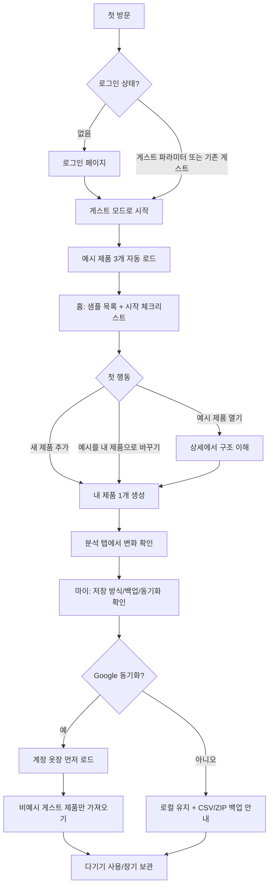

# 자아앙 UX 락인 및 네이티브 전환 판단 계획

작성일: 2026-05-10  
범위: 첫 방문, 게스트 샘플 3개, 제품 등록/상세, 분석, 마이/백업/동기화, 향후 앱 전환

## 1. 결론

지금은 풀 네이티브 재설계를 하면 안 된다. 현재 방향은 `웹/PWA 유지 + 온보딩 락인 강화 + 필요 시 Capacitor 네이티브 셸`이 맞다.

이유는 명확하다.

- 현재 앱은 이미 Vite + React + TypeScript 기반으로 목록, 필터, 상세 편집, 이미지, 분석, 마이페이지, 백업, 게스트/Google 전환을 갖고 있다.
- 사용자가 처음 느끼는 핵심 가치는 네이티브 제스처나 앱스토어 존재감이 아니라 `내 옷을 빠르게 남기고, 다시 찾고, 분석으로 되돌아보는 것`이다.
- web.dev 기준 PWA는 단일 코드베이스로 설치, 독립 창, 오프라인, OS 통합 일부를 제공한다. 반대로 네이티브 앱은 파일/하드웨어/사진/백그라운드 통합이 강하지만 앱스토어 심사, 재패키징, 플랫폼별 구현 비용이 붙는다.
- Capacitor는 기존 웹 코드를 유지하면서 iOS/Android 네이티브 셸과 네이티브 SDK 접근을 붙이는 전략이다. 이 앱의 다음 단계와 가장 잘 맞는다.

따라서 제품 전략은 다음 순서가 좋다.

1. MVP: 현재 웹/PWA에서 첫 3분 가치와 개인 데이터 락인을 완성한다.
2. 베타: PWA 설치 안내, 이미지/백업/동기화 신뢰 UX, 모바일 사용성을 강화한다.
3. 앱스토어 필요 시: Capacitor 셸로 포장하고 사진 선택, 공유 시트, 푸시, 파일 export/import 같은 네이티브 가치만 붙인다.
4. 풀 네이티브: 사진 촬영/AI 분류/백그라운드 리마인드/위젯/오프라인 대량 이미지 처리 등이 제품 가치의 절반 이상이 될 때만 검토한다.

## 2. 현재 구현에서 이미 좋은 점

### 게스트 우선 진입

`src/LoginPage.tsx`는 로그인보다 게스트 시작을 우선 CTA로 둔다. 게스트 설명도 "브라우저 저장"과 "예시 제품 3개"를 명시한다.

- `src/LoginPage.tsx:31`: 게스트로 바로 시작하고 필요할 때 Google 전환 가능
- `src/LoginPage.tsx:35`: 게스트 모드로 시작하기
- `src/LoginPage.tsx:46`: 처음 시작하면 예시 제품 3개 표시

이건 초기 락인 관점에서 맞다. 회원가입 전에 가치를 보여주고, 데이터가 생긴 뒤 계정 전환을 권유하는 구조이기 때문이다.

### 샘플 3개 자동 로드

게스트 모드가 켜지면 임시 DB를 열고, 로컬 아이템이 없을 때 예시 CSV에서 정확히 3개를 가져온다.

- `assets/js/app.js:403`: `startTemporarySession`
- `assets/js/app.js:425`: 로컬 아이템 로드
- `assets/js/app.js:426-428`: 비어 있으면 `importGuestSampleCsv`
- `assets/js/app.js:744-760`: CSV에서 예시 3개를 골라 저장

샘플 3개는 "빈 화면"을 피하기 위한 장식이 아니라, 첫 사용자가 제품 구조와 분석 결과를 즉시 보는 장치다. 계속 유지해야 한다.

### 분석까지 연결되는 가치 루프

분석 페이지는 bridge로 현재 옷장 데이터를 받아 요약, 소비, 색상, 실측, 브랜드 섹션을 바로 렌더링한다.

- `src/AnalysisPage.tsx:31-43`: legacy bridge에서 분석 아이템 수신
- `src/AnalysisPage.tsx:51-58`: 보유/전체 필터와 분석 계산
- `src/AnalysisPage.tsx:63-65`: 구매 총액을 앱 타이틀 컨텍스트로 반영
- `src/AnalysisPage.tsx:97-101`: 요약, 소비, 색상, 실측, 브랜드 분석 렌더링

실제 확인 결과, 게스트 샘플 3개만으로도 `보유 3개 분석 · 구매 31만원` 흐름이 보인다. 이건 "데이터가 쌓이면 뭐가 좋아지는지"를 매우 빨리 보여주는 좋은 MVP 자산이다.

### 마이페이지의 데이터 신뢰 구조

마이페이지는 로컬 저장, 동기화 상태, 제품 수, CSV/JSON/ZIP 백업, 게스트 데이터 초기화를 한 화면에 둔다.

- `src/MyPage.tsx:122-145`: Google 동기화, 로그인 화면 복귀, 게스트 옷장 가져오기
- `src/MyPage.tsx:154-173`: 저장 방식, 동기화, 대기 작업, 최근 동기화, 제품 수
- `src/MyPage.tsx:203-231`: CSV, JSON, ZIP 백업
- `src/MyPage.tsx:241-242`: 게스트 옷장과 계정 옷장의 분리 안내

개인 옷장 서비스는 "내 데이터가 날아가지 않는다"는 신뢰가 곧 리텐션이다. 이 구조는 더 키워야 한다.

## 3. 현재 UX의 가장 큰 빈틈

### 3.1 샘플은 있는데 "다음 행동"이 약하다

처음 들어오면 예시 제품 3개가 보이지만, 사용자가 다음에 무엇을 하면 이 서비스가 자기 것이 되는지 명확하지 않다.

현재 사용자는 다음 선택지를 스스로 추론해야 한다.

- 예시 제품을 눌러 상세를 본다.
- 새 제품을 만든다.
- 분석 탭을 눌러본다.
- 마이에서 백업/동기화를 본다.

이 흐름은 기능적으로는 맞지만, 초기 락인에는 한 단계 부족하다. 서비스가 "이 3개 예시를 보고 네 물건 하나를 넣어봐"라고 안내해야 한다.

### 3.2 튜토리얼을 넣는다면 모달 강의가 아니라 활성화 체크리스트여야 한다

외부 UX 자료와 Lazyweb 레퍼런스는 공통적으로 긴 설명형 튜토리얼보다 다음 패턴을 권한다.

- 빈 상태나 기본 샘플 데이터에서 바로 행동을 유도한다.
- 사용자가 실제 작업을 하면서 배운다.
- 진행 상황을 짧게 보여준다.
- 데이터/백업/동기화는 별도 기능 설명보다 필요한 순간에 안내한다.

자아앙에 맞는 형태는 3장짜리 온보딩 슬라이드가 아니다. `시작 체크리스트`가 맞다.

첫 실행 체크리스트:

1. 예시 제품 하나 열어보기
2. 내 제품 하나 추가하거나 예시 제품을 내 제품으로 바꾸기
3. 분석에서 구매/색상/브랜드 인사이트 확인하기
4. 마이에서 백업 또는 Google 동기화 확인하기

첫 화면에 모든 설명을 띄우지 말고, 사용자가 샘플 목록을 보는 상태에서 작은 패널로 제시한다. 완료되면 사라지고, 마이페이지에서 다시 볼 수 있게 한다.

### 3.3 예시 제품과 내 제품의 경계가 UX로는 약하다

코드상으로는 예시 제품이 merge 대상에서 제외된다.

- `assets/js/app.js:810-813`: temp DB에서 sample item 제외
- `assets/js/closet-guest-merge-utils.js:33-36`: guestSample 판별
- `assets/js/closet-guest-merge-utils.js:70`: 계정 import 시 guestSample false 처리

하지만 사용자에게는 예시 제품이 "그냥 내 옷장에 들어온 제품"처럼 보인다. 이건 좋은 방향일 수도 있지만, 초반에는 혼란을 줄 수 있다.

개선안:

- 샘플 카드에 아주 약한 `예시` 라벨을 유지한다.
- 상세 화면 상단에 `이 제품은 예시입니다` 안내를 짧게 보여준다.
- CTA는 `내 제품으로 바꾸기`, `예시 숨기기`, `비슷한 제품 추가` 중 하나로 둔다.
- `내 제품으로 바꾸기`를 누르면 브랜드/이름/가격/이미지만 빠르게 수정하는 경량 편집 상태로 진입한다.

### 3.4 게스트 시작 후 딥링크가 루트로 되돌아간다

`startTemporarySession`은 public path가 아니면 항상 앱 루트로 이동한다.

- `assets/js/app.js:433-435`: 게스트 시작 후 `navigateToAppRoot`

실제 Playwright 확인에서도 `/analysis`나 `/my`로 직접 진입하면 게스트 초기화 뒤 `/`로 돌아갔고, 하단 탭 클릭으로는 정상 이동했다. 기능 고장은 아니지만, 향후 설치형 앱/푸시/딥링크/공유 링크가 생기면 손실이 된다.

개선안:

- 게스트 시작 직전의 intended path를 저장한다.
- `/analysis`, `/my` 같은 앱 내부 라우트는 게스트 세션 시작 후 원래 목적지로 복원한다.
- 단, `/login`에서 게스트 버튼을 누른 경우에는 `/`가 맞다.

## 4. 설계할 사용자 경험 흐름도

목표는 사용자를 처음부터 가입시키는 것이 아니다. `내 데이터 하나를 넣게 해서 떠나기 어렵게 만드는 것`이다. 가입은 그 다음이다.

## 5. 권장 개선안

### Phase 1: 제품 코드 리스크가 낮은 락인 강화

목표: 첫 방문 3분 안에 "샘플 보기 → 내 제품 1개 → 분석 확인"을 만든다.

변경 후보:

- `src/App.tsx`: 홈 상단에 첫 실행 체크리스트 영역 추가
- `assets/js/app.js`: 체크리스트 진행 상태를 localStorage/IndexedDB meta에 저장
- `src/ClosetDetailDialog.tsx`: 예시 제품 상세에서 `내 제품으로 바꾸기` 또는 `비슷한 제품 추가` CTA 추가
- `src/AnalysisPage.tsx`: 샘플만 있을 때 `예시 데이터 기준 미리보기` 안내 배너 추가
- `src/MyPage.tsx`: 게스트 상태에서 "백업부터 하기"와 "Google로 동기화하기"의 차이를 더 명확히 표시

완료 기준:

- 새 사용자가 로그인 없이 홈에 들어오면 샘플 3개와 시작 체크리스트를 본다.
- 샘플 제품 하나를 열면 상세 구조를 이해하고 바로 자기 제품 추가로 이어질 수 있다.
- 내 제품 1개를 추가하면 체크리스트가 갱신된다.
- 분석 탭을 방문하면 체크리스트가 갱신된다.
- 백업 또는 동기화 행동은 마이페이지에서 자연스럽게 연결된다.

### Phase 2: 데이터 신뢰와 재방문 루프

목표: "내가 넣은 데이터가 남아 있고, 옮길 수 있고, 더 쌓을수록 유용하다"를 강화한다.

변경 후보:

- PWA 설치 안내: 첫 제품 추가 후 또는 두 번째 방문 때만 표시
- 마이페이지 상단: `이 브라우저에 저장됨`, `마지막 백업`, `마지막 동기화`를 더 강하게 시각화
- 분석 저데이터 상태: 1개, 3개, 10개 이상일 때 보여줄 수 있는 인사이트를 단계별로 다르게 구성
- 빈 상태: 필터 결과 없음과 전체 데이터 없음을 분리하고, 각각 `필터 초기화`, `새 제품 추가`, `CSV 가져오기` CTA 제공

### Phase 3: 앱 셸 준비

목표: 풀 네이티브가 아니라, 기존 웹 코어를 앱스토어 배포 가능한 형태로 감싼다.

변경 후보:

- manifest, icon, splash, safe-area, standalone display 품질 점검
- iOS/Android 홈 화면 설치 안내
- Capacitor PoC: 기존 build 산출물을 앱 셸에서 띄우고, 파일 import/export와 이미지 선택만 네이티브 플러그인으로 검증
- 푸시 알림은 "구매 후 오래 안 입은 옷", "백업 오래됨"처럼 실제 리텐션 가치가 생길 때만 붙인다.

## 6. 네이티브 전환 판단 기준

### 지금 풀 네이티브로 가지 말아야 하는 이유

- 현재 앱의 복잡도는 UI보다 데이터 모델, 이미지 저장, 게스트/계정 병합, 백업, 분석에 있다. 네이티브 재작성은 이 복잡도를 없애지 않고 다시 구현하게 만든다.
- 웹은 배포와 수정 속도가 빠르다. MVP 초기에는 사용자의 실제 행동을 보고 매주 고쳐야 하므로 앱스토어 심사/배포 주기가 손해다.
- iOS/Android를 동시에 풀 네이티브로 가면 기능 동기화, QA, 데이터 마이그레이션, 디자인 일관성 비용이 크게 늘어난다.
- 이미 PWA 기본 요소가 있다. `manifest.webmanifest`는 standalone display를 설정하고, `sw.js`는 navigation fallback과 cache 전략을 갖고 있다.

### Capacitor 셸을 시작할 시점

다음 조건 중 2개 이상이면 Capacitor PoC를 시작한다.

- 사용자들이 모바일 홈 화면 아이콘/앱스토어 설치를 요구한다.
- 사진 추가, 파일 백업/복원, 공유 시트가 웹에서 불편하다는 피드백이 반복된다.
- 재방문 유도를 위해 푸시/배지/리마인더가 필요해진다.
- 웹 MVP의 핵심 퍼널이 안정화되어 UI가 크게 바뀌지 않는다.
- 앱스토어 검색/리뷰/신뢰가 유입 채널로 의미 있어진다.

### 풀 네이티브를 다시 검토할 시점

다음 조건 중 3개 이상이면 React Native 또는 네이티브 재설계를 별도 검토한다.

- 카메라 촬영, 이미지 크롭/보정, 온디바이스 AI 분류가 핵심 사용 시간의 대부분을 차지한다.
- 1만 개 이상 아이템/이미지를 오프라인에서 매우 빠르게 다뤄야 한다.
- 위젯, Live Activity, Siri/Shortcuts, Apple Watch 같은 OS 기능이 핵심 리텐션 수단이 된다.
- 웹뷰 성능이나 iOS storage 제약 때문에 실제 사용자 데이터 손실/성능 문제가 확인된다.
- 앱 개발/QA를 장기적으로 감당할 리소스가 있다.

## 7. 이벤트와 측정

초기에는 외부 분석 도구를 바로 붙이기보다 local/dev 이벤트부터 정의한다.

- `first_sample_opened`
- `first_item_created`
- `sample_converted_to_own_item`
- `first_analysis_viewed`
- `backup_exported`
- `sync_prompt_seen`
- `login_started_after_local_item`
- `guest_merge_completed`
- `pwa_install_prompt_seen`

핵심 지표:

- 첫 방문에서 샘플 상세 열람률
- 첫 방문 또는 24시간 내 내 제품 1개 생성률
- 첫 제품 생성 후 분석 탭 방문률
- 첫 제품 생성 후 백업/동기화 확인률
- 7일 내 재방문률

## 8. 참고 근거

- web.dev PWA 문서: PWA는 단일 코드베이스, 설치, 독립 창, 오프라인, 일부 OS 통합을 제공하지만, 플랫폼별 기능과 브라우저 차이를 고려해야 한다.
- web.dev PWA 설치 문서: PWA는 Google Play, Apple App Store, Microsoft Store 등에도 패키징될 수 있지만 각 스토어 요구사항을 확인해야 한다.
- Capacitor v8 문서: 기존 웹 앱을 web-first로 유지하면서 iOS/Android 네이티브 SDK 접근을 붙일 수 있다.
- Apple/WebKit Web Push 자료: iOS 16.4 이후 홈 화면 웹 앱도 웹 푸시/배지 지원이 가능하지만, 사용자가 홈 화면에 추가하고 권한을 승인하는 흐름이 필요하다.
- Lazyweb 레퍼런스: Bins, Coinsnap, eBay My Collection, DuckDuckGo Sync & Backup은 각각 샘플/첫 아이템, 컬렉션 빈 상태, 단계형 컬렉션 온보딩, 데이터 백업 신뢰 UX의 참고 사례로 사용했다.

